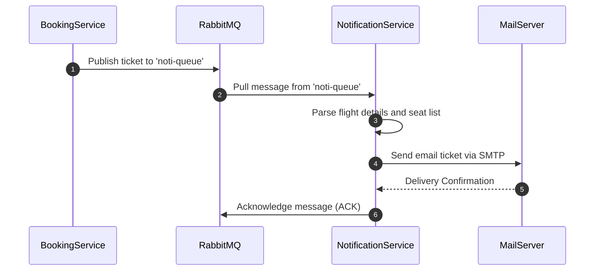

# Notification Service (Deployed on Render)


## 1. Service Overview
The **Notification Service** is an event-driven helper utility responsible for asynchronous email dispatch. It consumes transaction payloads from RabbitMQ and fires confirmation alerts to users.

### Business Responsibilities
- **RabbitMQ Queue Consumer**: Binds to the broker exchange to retrieve ticket dispatch events (`noti-queue`).
- **Email Generation**: Parses payloads to extract names, flight routes, booking reference IDs, and seat details to compile email bodies.
- **SMTP Gateway client**: Interfaces with SMTP providers (Nodemailer) to dispatch tickets.

---

## 2. Folder Structure
```
Noti-Service/
├── src/
│   ├── config/             # Mailer & RabbitMQ server bindings
│   ├── services/           # Mail dispatch actions
│   └── utils/
```
### Folder Responsibilities
- **`config/email-config.js`**: Binds Nodemailer transport protocols.
- **`config/queue-config.js`**: Connects and listens to the RabbitMQ channel.

---

## 3. Architecture Diagram
```
[RabbitMQ Broker] 
       │ (noti-queue message)
       ▼
[Notification Service] 
       │ (SMTP Client)
       ▼
[Mail Server / SMTP Gateway]
```

---

## 4. Sequence Diagrams

### Notification Delivery


---

## 5. API Documentation
The Notification Service is entirely event-driven and does not expose HTTP rest routes. 

### RabbitMQ Message Payload Schema (`noti-queue`)
```json
{
  "subject": "Booking Confirmation - Booking Mafia",
  "recipientEmail": "user@gmail.com",
  "text": "Your booking is confirmed! Details: Booking ID 48. Seats: 12A, 12B. Have a pleasant flight!"
}
```

---

## 6. Database Schema
No direct database links are maintained by this microservice.

---

## 7. Service Communication
- **Consumer**: Binds to `noti-queue` on the RabbitMQ broker instance (`amqp://localhost:5672`).

---

## 8. Docker Documentation
- **Build Command**:
  ```bash
  docker build -t bookingmafia/noti-service:latest .
  ```
- **Ports**: Exposes port `3002`.
- **Environment Variables**:
  - `PORT=3002`
  - `RABBITMQ_URL=amqp://rabbitmq-broker:5672`
  - `GMAIL_SMTP_USER=example@gmail.com`
  - `GMAIL_SMTP_PASS=password`

---

## 9. Kubernetes Documentation
- **Deployment**: Standard pod template deployment.
- **Service**: Port binding for health checks.

---

## 10. Environment Variables
See `.env.example`:
```ini
PORT=3002
RABBITMQ_URL=amqp://localhost
GMAIL_SMTP_USER=example@gmail.com
GMAIL_SMTP_PASS=password
```

---

## 11. Error Handling Strategy
- Retries RabbitMQ connection with backoff.
- Catches SMTP delivery errors and preserves unacknowledged queue records.

---

## 12. Logging Strategy
- Logs received queue payload headers and email confirmation IDs.

---

## 13. Scaling Strategy
- Spin up multiple node consumer instances. RabbitMQ will distribute events round-robin.

---

## 14. Security
- Binds credentials to environment injection systems.

---

## 15. Future Improvements
- **HTML Templates**: Use EJS/Pug templates for pretty tickets.
- **SMS Gateway**: Support SMS updates via Twilio.
